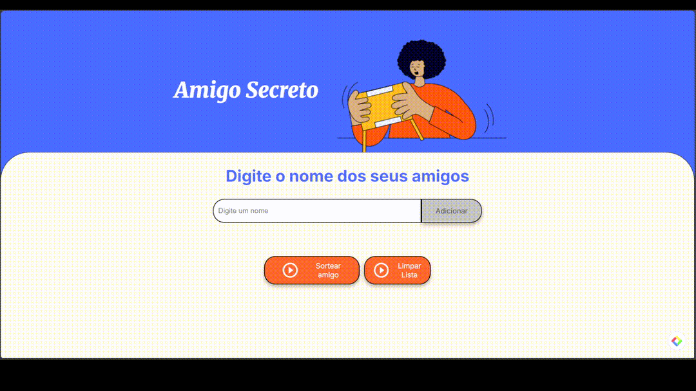

# Amigo Secreto

Amigo Secreto é uma aplicação web que permite aos usuários inserir nomes de amigos e, em seguida, realizar um sorteio aleatório para determinar quem será o "amigo secreto". Este projeto foi desenvolvido com o objetivo de aprimorar habilidades em lógica de programação e manipulação do DOM. Esta aplicação foi desenvolvida como parte de um projeto de aprendizado, utilizando HTML, CSS e JavaScript.
## 📋 Pré-requisitos
- Navegador web moderno (Chrome, Firefox, Safari, etc.)
- Conhecimento básico de HTML, CSS e JavaScript
## 🚀 Começando
1. Clone este repositório em sua máquina local.
2. Abra o arquivo `index.html` em um navegador web.


## 🔨 Funcionalidades do projeto

- **Adicionar nomes:** 
  O usuário insere o nome de um amigo no campo de texto e clica no botão "Adicionar" (ou pressiona a tecla Enter).  
  - Se o campo estiver vazio, o sistema exibe o alerta "Por favor, insira um nome."
  Do contrário, o nome digitado é adicionado a um vetor (array amigos) e exibido em uma lista na página.
  Em seguida, o campo de texto é limpo para que o usuário possa inserir outro nome.

- **Visualizar a lista de amigos:**  
  A lista de nomes inseridos é exibida dinamicamente.  
  - Para cada amigo não sorteado, é exibido um botão "Remover" ao lado do nome, permitindo que o usuário exclua individualmente um amigo da lista.  
  - Quando um amigo é sorteado, seu nome é exibido com a marcação " (Selecionado)" e o botão "Remover" é removido desse item permitindo que o usuário veja quais amigos já foram selecionados.

- **Limpar lista de amigos:**
  O usuário pode limpar toda a lista de amigos clicando no botão "Limpar Lista". Isso remove todos os nomes da lista, limpa o campo de entrada e também o resultado do sorteio, permitindo que o usuário possa começar um novo sorteio.

- **Sortear amigo:**
  Ao clicar no botão "Sortear amigo", a aplicação realiza um sorteio aleatório de um dos nomes da lista e exibe o resultado na tela:
  - Apenas os amigos que ainda não foram sorteados (não marcados como "Selecionado") são considerados.
  - O amigo sorteado é marcado como selecionado, seu nome é exibido com a indicação " (Selecionado)" na lista e o resultado do sorteio é mostrado na tela.
  - Se todos os amigos já tiverem sido sorteados, o botão "Sortear amigo" é desabilitado e o sistema exibe a mensagem "Todos os amigos já foram selecionados!".

  - **Ação com a tecla Enter:**  
  Ao digitar o nome no campo de entrada, o usuário pode pressionar a tecla <Enter> para acionar a função de adicionar amigo, sem precisar clicar no botão "Adicionar".


## 📷 Demonstração

*Exemplo visual do funcionamento do Amigo Secreto:*



## ✔️ Técnicas e tecnologias utilizadas

- **HTML:** Estrutura da aplicação.
- **CSS:** Estilização da aplicação, com foco em responsividade e layout moderno.
- **JavaScript:** Lógica para manipulação do DOM, atualização da lista e sorteio aleatório dos nomes.
- **DOM Manipulation:** Uso de métodos como `document.getElementById`, `document.createElement` e `innerHTML` para atualizar a interface dinamicamente.

## 🛠️ Acesso ao projeto

Para abrir e rodar o projeto, siga estas etapas:
1. Clone o repositório:
```bash
git clone https://github.com/rfcamera/amigo-secreto.git
```
2. Navegue até o diretório do projeto:
```bash
cd amigo-secreto
```
3. Abra o arquivo `index.html` em um navegador da web.

## 📁 Estrutura do projeto

```
├── assets
|    ├── amigo-secreto-thumbnail.png
|    ├── amigo-secreto.png
|    ├── output1080_plus.gif
|    └── play_circle_outline.png
├── .gitignore
├── app.js
├── index.html
├── README.md
└── style.css
```

## 📧 Contato

Se você tiver alguma dúvida ou sugestão, entre em contato comigo através do meu [e-mail](mailto:robertofontescamera@gmail.com).

